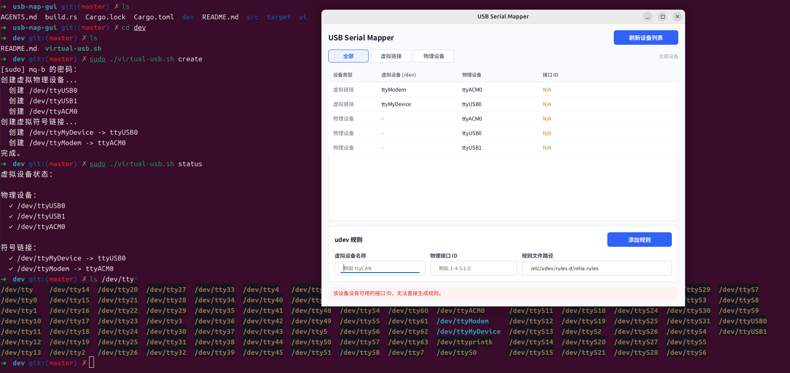
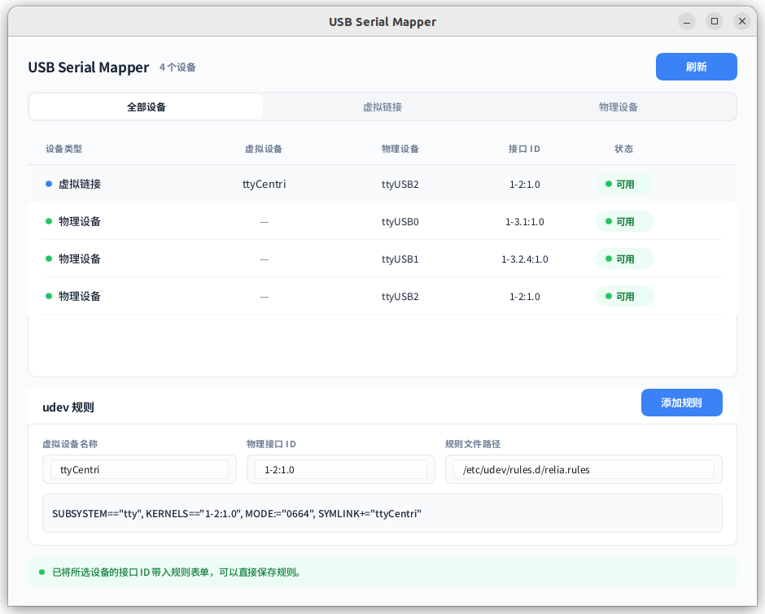

# usb-map-gui

基于 [`Mq-b/usb_map`](https://github.com/Mq-b/usb_map) 的 Rust + Slint GUI 实现，专用于 Linux USB 串口设备映射与 udev 规则生成。

**示例界面：**

> 虚拟接口示例（通过 [`virtual-usb.sh`](./dev/virtual-usb.sh) 脚本创建）：



> 真实设备情况：



## 功能特性

- 扫描 `/dev` 下的 `ttyUSB*`、`ttyACM*` 设备及符号链接
- 读取并显示 USB 接口 ID、物理设备路径、虚拟设备名称映射
- 生成符合 `SUBSYSTEM=="tty"` 格式的 udev 规则，创建稳定的 `/dev/<name>` 符号链接
- 支持规则文件的创建与更新

## 与上游项目的关系

基于上游 C++ 终端程序 `usb_map` 的核心逻辑，主要改进：

- **技术栈**：C++ → Rust + Slint GUI
- **架构**：模块化设计（界面、事件、业务逻辑分离）
- **规则格式**：使用 `SUBSYSTEM=="tty"` 统一兼容 `ttyUSB*` 与 `ttyACM*`
- **范围**：仅保留 `usb_map` 功能，移除 `find_4g_module`

## 运行环境

- Linux 系统
- 依赖 `/dev`、`udev`、`libudev`
- 写入 `/etc/udev/rules.d/` 需要 root 权限

## 快速开始

```bash
cargo run --release
```

**界面说明：**

1. **设备列表**：显示当前串口设备映射关系，点击行自动填充表单
2. **规则表单**：生成或更新 udev 规则

## 规则格式

生成的 udev 规则格式：

```txt
SUBSYSTEM=="tty", KERNELS=="<物理ID>", MODE:="0664", SYMLINK+="<虚拟名称>"
```

生效方式：

```bash
sudo udevadm control --reload-rules && sudo udevadm trigger
```

## 项目结构

```
ui/
  app_window.slint      # 主窗口布局
  device_table.slint    # 设备列表组件

src/
  main.rs               # 程序入口
  app_controller.rs     # 界面事件和状态流转
  ui_bindings.rs        # Slint 属性绑定与界面数据转换
  device_scan.rs        # /dev 扫描与 libudev 查询
  rule_file.rs          # udev 规则生成与更新
  models.rs             # 共享数据结构
```

## CI/CD

GitHub Actions 工作流：

- 在 `ubuntu-22.04` 和 `ubuntu-24.04` 上编译测试
- 使用 `actions/cache` 缓存依赖
- 推送 `v*` 标签时自动发布到 GitHub Releases

## 依赖说明

Rust crate 依赖静态链接，系统库（`libc`、`libudev`、窗口系统库）动态链接。
